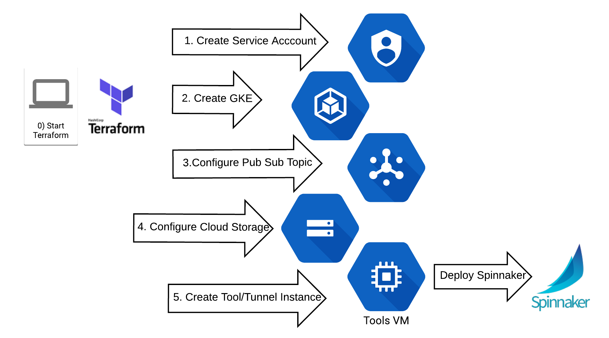

# Google Cloud Platform Featuring GKE

The process is illustrated as follows:

Essentially, from your workstation you are using TerraForm to create a service account. K8 cluster and to launch and instance that will run a script landed by terraform to perform the creation of  jenkins and Spinnaker.

If you want to learn more about using GCP, I would recommend a [coursera course](https://www.coursera.org/learn/gcp-infrastructure-foundation) but it is not a prerequisite.

## Let's Get Started

You need to validate your GCP project and make sure terraform can do what it needs to do. Before you start, make sure you have git installed, gcloud sdk installed and up to date, and terraform installed. All of these items need to be in your path. These steps assume a fresh GCP project.

As always git clone this repo (or a fork of it)

### Validate your GCP project

#### Connectivity

To make sure we don't stumble into problems later, you need to perform the following:
1. Create a [Service account](https://cloud.google.com/compute/docs/access/create-enable-service-accounts-for-instances) with  'role/owner' for Terraform. Call it `terraform-admin` (or anything you will remember).
    1. If you are presented with the option to generate a JSON key file do and save it for later.
1. Create a micro instance in `us-central1-a` with the service account `terraform-admin` (or whatever you called it)
1. Now leave your browser and open a terminal window
1. Perform a [gcloud init](https://cloud.google.com/sdk/gcloud/reference/init) if you have not done so as part of installing gcloud
   1. Make sure your your environment is referencing the current project (via `gcloud info`)
1. From your laptop perform a `gcloud ssh` into said instance. You can get the full  `gcloud` command from the dropdown arrow next to the SSH button for the instance.  
   1. This is to check connectivity between your laptop to GCP in a manner similar to what terraform will ultimately do.

If everything happened without issue then we are good. You no longer need this test instance. You can delete it. We will use the service account to set-up terraform.

#### Enable Google Project Features

After verifying connectivity, we need to enable services/api endpoints for terraform.

Using the terminal window where you just attempted `gcloud ssh` perform the following commands to enable APIs for your project

1. `gcloud services enable container.googleapis.com`
1. `gcloud services enable iam.googleapis.com`
1. `gcloud services enable cloudresourcemanager.googleapis.com`

Those commands should have completed successfully.

### Set-up Terraform

If you were able to perform the final ssh option with gcloud you inadvertently performed most of the prep to enable terraform to work on your Google Project.

#### Configure Terraform GCP Credentials
Terraform needs credentials to perform administrator level operations. To do this you need to download a json credentials file.

_If you already created the json key file previsoulsy, skip to step 5_
1. Log into the Google  Console and select the project.
1. Navigate to `IAM & Admin`, click on "Service Accounts" on the left
1. In the list of accounts locate `terraform-admin` and in the options column select `create key`
1. A json key file should be downloaded to your machine.
1. Move/rename the json file to `gcp-account.json` and place in the folder with the other terraform scripts
   1. Assumes you already git cloned

#### Configure Terraform SSH

Since, you were successful with `glcoud ssh` there is already a ssh configuration information located in `/home/[username]/.ssh/google_compute_engine`. Terraform will expect them to be there.

## For Advanced Users

If you consider yourself DNS/TLS/Oauth2 capable, consider enabling those features [here](DNSTLSOauth2.md) before continuing.

## Finally You are ready to begin

At this point, you need to change directory into the terraform folder and type:

`whoami` which will get you your ssh username. You will use this later. Also make sure you have your GCP project ID (which could be different from project name) handy.

`terraform init`

`terraform plan`

it will prompt you for the ssh username and google project id. It will then show you the actions that it is going to attempt. If you agree with the plan...

`terraform apply` and enter the ssh user name and project id again.

Now, wait 20 minutes.

## Validate and connect with your new Toys

Using your work station you will create an SSH tunnel to your 'halyard-tunnel' GCP instance  created by terraform

`
gcloud compute --project "[PROJECT_NAME]" ssh --zone "[THE ZONE YOU DEPLOYED TOO]" "[halyard-tunnel or whatever]"  --ssh-flag="-L 9000:localhost:9000" --ssh-flag="-L 8084:localhost:8084"
`

Once there you will then perform `hal deploy connect`

If this works, navigating to `http://localhost:9000/` (incognito mode preferred) should give you the spinnaker interface.

## Post Deploy Pipeline Templates Set-up

Now that Spinnaker is set up, you can proceed with installing some [**Pipeline Templates**](https://github.com/spinnaker/dcd-spec/blob/master/PIPELINE_TEMPLATES.md) to get a feel for Spinnaker Pipelines.

Instructions are located [**here**](../pipelines/README.md)

## Do see the Release notes

[Release Notes](RELEASE_NOTES.MD)

## What about using the Google Cloud Shell?

Yes, you can use the Google Cloud Shell!

There are only a couple changes
1. You don't need to gcloud init in the shell
1. You don't need to install git (it is there already)
1. You do need to install terraform
1. To get the Service account key for terraform you need to perform
    1. Navigate to the terraform folder of you git clone of this project
    1. gcloud iam service-accounts keys create gcp-account.json --iam-account {serviceacounntname}@{GCP Project Name}.iam.gserviceaccount.com
1. You still need to perform the connectivity test
