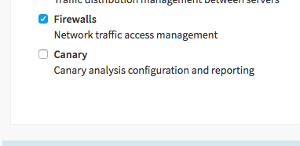

# Canary in the Coal Mine

This demonstrates how to use Spinnaker's new Automated Canary Analysis Service. 
You can read about it [here](https://medium.com/netflix-techblog/automated-canary-analysis-at-netflix-with-kayenta-3260bc7acc69) and [here](https://cloud.google.com/blog/products/gcp/introducing-kayenta-an-open-automated-canary-analysis-tool-from-google-and-netflix).

It is recommended that you read this entire document before proceding

## Setup Procedure

- This depends on the *HelloAgain* app from previous pipeline steps. Make sure you have completed the previous pipeline exercices. 
- This pipeline assumes previous trigger work and deployments where executed. 

### Disable previous "prod" pipeline

The canary pipeline will replace the existing prod pipeline. First, run the production pipeline and make sure that app deploys successfully. You can disable/delete this pipeline. 

### Enable Canary for you app

By defaults, "apps" in Spinnaker are not canary enabled you will need to enable it. 
To enable the canary feature go the `helloagain` app

This will enable the *Delivery* options. It is recommended that you refresh the browser to get this new top level menu item as shown below:

### Deploy Canary Pipeline

As with previous pipeline deployment, access the *tunnel instance* and navigate to gcp pipeline folder for canary. Once there execute the following command  

`spin pipeline save --file=canary_prod.json`

This will deploy the canary pipeline for the `helloagain` app but the pipeline is disabled.

### Create Analysis Configuration for Canary

The canary step needs a Canary Configuration

--- image of canary step missing configuration ---

Let's create a canary configuration. 

## Run pipeline

This pipeline can take an hour to execute...because...the canary step is set to run for an hour. It is configured in `realtime` mode which requires enough real time to elapse for data capture. 

### Run it
 You can either manually run it or trigger the UAT pipeline. Explore the reports and metrics thate are displayed during/after pipeline execution

### Run it with some load

Since Canary is for *PRODUCTION* you need to create some load. You can use the gist to generate load for your application. If you have an http load generating utility point it at the production load balancer while the pipeline is running. If not use this gist to generate load.  

### Change the App

If you have been using the `hello-karyon-rxnetty` (AKA *HelloAgain* )app in this series we need to modify it to be "fatter". If you look [here](https://github.com/nparks-kenzan/hello-karyon-rxnetty-x/blob/feature/memoryhog/src/main/java/com/kenzan/karyon/rxnetty/endpoint/HelloEndpoint.java) you will see that we are making invocations to the primary endpoint larger when someone hits the hello endpoint and pass a string. 

For Example:
`curl http://IP_of_loadbalancer/hello/stingOfchoice`

 

## ... Next

Decompose all the pipeline steps and their implications. What possible paths are not covered? What Errors are not accounted for?