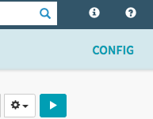
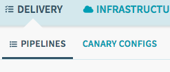
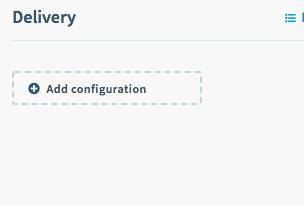
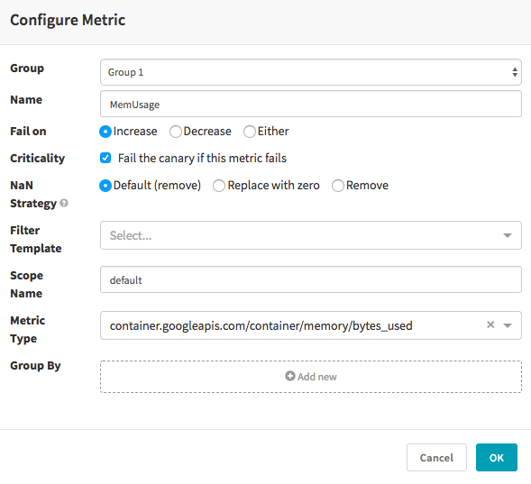
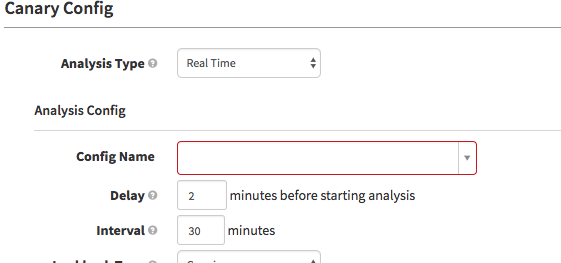

# Canary in the Coal Mine

This demonstrates how to use Spinnaker's new Automated Canary Analysis Service. 
You can read about it [here](https://medium.com/netflix-techblog/automated-canary-analysis-at-netflix-with-kayenta-3260bc7acc69) and [here](https://cloud.google.com/blog/products/gcp/introducing-kayenta-an-open-automated-canary-analysis-tool-from-google-and-netflix).

It is recommended that you read this entire document before proceding

## Setup Procedure

- This depends on the *HelloAgain* app from previous pipeline steps. Make sure you have completed the previous pipeline exercices. 
- This pipeline assumes previous trigger work and deployments where executed. 

### Disable/Delete previous "prod" pipeline

The canary pipeline will replace the existing prod pipeline. First, run the production pipeline and make sure that app deploys successfully. Then you can either delete or disable the pipeline. To delete the pipeline with the `spin` cli with:

`spin pipeline delete --name prod-seed --application helloagain`

### Enable Canary for you app

By defaults, "apps" in Spinnaker are not canary enabled you will need to enable it. 
To enable the canary feature go the `helloagain` app

Click on Config:

Scroll down to the features section and click check the canary box:

This will enable the *Delivery* options. It is recommended that you refresh the browser to get this new top level menu item as shown below:

### Deploy Canary Pipeline

As with previous pipeline deployment, access the *tunnel instance* and navigate to gcp pipeline folder for canary. Once there execute the following command  

`spin pipeline save --file=canary_prod.json`

This will deploy the canary pipeline for the `helloagain` app but the pipeline will not be executable.

#### Create Analysis Configuration for Canary

The canary step needs a Canary Configuration

Access the Canary Configuation Screen:

Then create a new Configuration:

Let's create a canary configuration. 

Name the configuration "K8Ram1500" with a description of "Simple Memory Growth Check". Procede to the "Metrics" section. 

You are going to add a metric to "Group 1". Click "Add Metric" and create a new metric as shown in the following image. 

Then press okay. 

Scroll down to the "Scoring Section" and set "Group 1" To 100.

Then save changes

#### Update Canary Setp in the Pipeline

With the need to update the Canary Analysis step of our new prod pipeline. Access the pipeline configuraiton and click on the `Canary Analysis` Step. You will see there is an error with the Canary step that we will fix by supplying the configuration we just created.  

Set the Config Name to `K8Ram1500` and save changes. 

#### Enable Pipeline Trigger

As shown in previous exercies regarding pipeline triggers, enable the trigger for you new prod pipeline featuring canary. 

## Run pipeline

This pipeline can take an hour to execute...because...the canary step is set to run for an hour. It is configured in `realtime` mode which requires enough real time to elapse for data capture. 

## Run it
 You can either manually run it or trigger the UAT pipeline. Explore the reports and metrics thate are displayed during/after pipeline execution

### Run it with some load

Since Canary is for *PRODUCTION* you need to create some load. Try using `Hey` that is located [here](https://github.com/rakyll/hey) (Why not run it in the google cloud shell?). Install `Hey` with:

`go get -u github.com/rakyll/hey`

Manually start the canary pipeline and run the following command with hey

`hey -c 50 -z 60m -m GET http://[IP ADDRESS OF Production LOAD BALANCER]/hello/somerandomstring` 

(Go take a break, this will be awhile, come back after lunch)

### Change the App

It is time to change the *HelloAgain* app. This requires that you have performed the steps in the previous exercise regarding pubsub.

we need to modify it to be "fatter". If you look [here](https://github.com/nparks-kenzan/hello-karyon-rxnetty-x/blob/feature/memoryhog/src/main/java/com/kenzan/karyon/rxnetty/endpoint/HelloEndpoint.java) you will see that we are making invocations to the primary endpoint larger when someone hits the hello endpoint and pass a string. Commit your changes to your fork. IF you need the previous exercises corretly, the `dev` pipeline will run followed by `uat` followed by the new `prod` featuring canary. 

Of course, when `prod` starts also start hey with
`hey -c 50 -z 60m -m GET http://[IP ADDRESS OF Production LOAD BALANCER]/hello/somerandomstring` 
 
You can use the GKE Dashboard to see load affect on the app. You can also use StackDriver.

## ... Next

1. Did the last Canary Pass/Fail?
1. Did the code change impact the app at all?
1. How would you change the Canary Pipeline?
1. Can You change the Canary Config to force a failure/success of the canary step?

Decompose all the pipeline steps and their implications.
1. What pipeline paths not covered?
1. What errors not accounted for?

In this exercises we used "Memory Usage" as a metric because it is *built in* and maybe (just maybe) if your changes do not alter functionality your app should not get bigger(?!?). However, you should consider items like error rates and latency among others. How would you intrument your environment (if you need to) to gather those metrics?

How Could I combine this with Istio Traffic Flow Control?